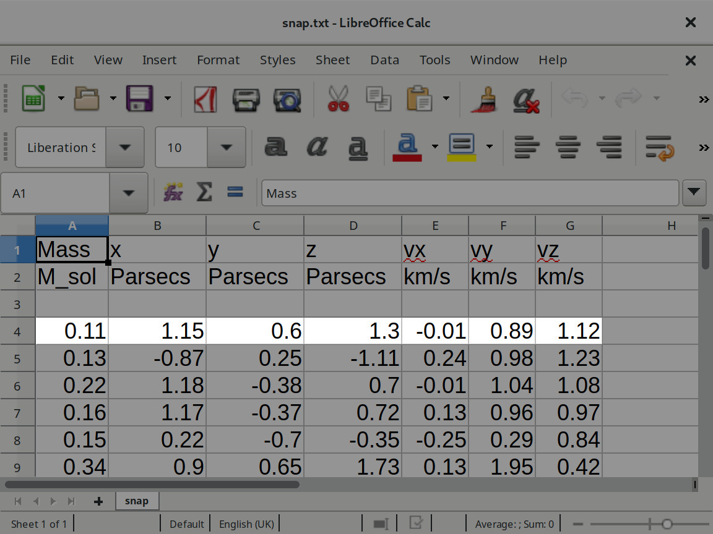
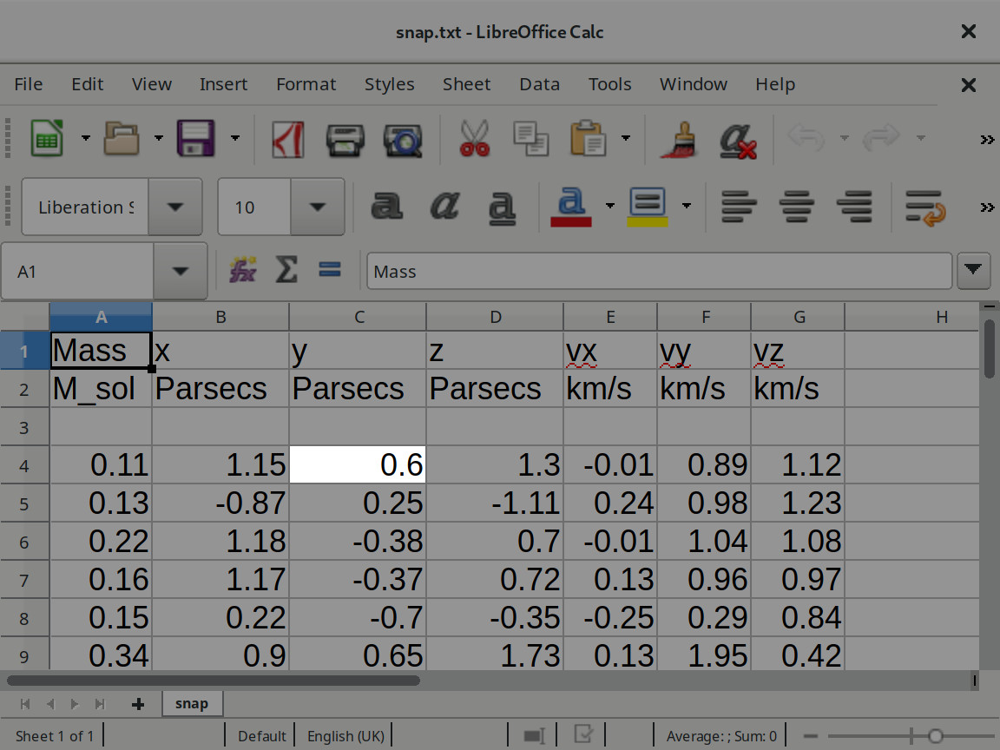

```{r setup, include=FALSE}
knitr::opts_chunk$set(comment="")
```

sed is a Unix utility that parses and transforms text
that remains in use for text processing, most notably with the substitution command.
awk is a programming language designed for text processing and typically used as a data extraction.
In conjuntion, they are a powerful tool for dealing with data.

The header of the file `snap.txt` file is

```{bash}
head -n 2 snap.txt
```

In the situation that the units of velocity are wrong,
they should be m/s instead of km/s,
we could open the file `snap.txt` with our favourite text editor
and fix it.
But, if we have hundreds of `snap.txt` files,
fix each one by hand would be very time consuming.
sed is the perfect tool to use in situations like this.
To replace km/s with m/s we can use

```{bash}
sed 's/km\/s/m\/s/g' snap.txt
```

The `s/km\/s/m\/s/g` is the script that sed applied to `snap.txt`.
It is hard to read with all the `/` and `\`
but the syntax of the substitute command is `s/regexp/replacement/[flags]`
and in our case we had to use some `\` as escape character.
The `g` flag means "apply the replacement to all matches to the regexp, not just the first."

You should notice that sed didn't change the file.

```{bash}
head -n 2 snap.txt
```

If we want that sed overwrite the file, we can use `sed -i`.

So far,
we applied the substitution to all the lines of the file.
We can be more selective if we want by
providing the lines
or one regular expression.
For example,
the header of the file is only the first two lines.

```{bash}
sed '1,2s/km\/s/m\/s/g' snap.txt | head
```

And the same line that we have km/s has sol:

```{bash}
sed '/sol/s/km\/s/m\/s/g' snap.txt | head
```

Some of other commands supported by sed

- `i text`: insert text before a line

  ```{bash}
  sed '1i foo' snap.txt | head
  ```
- `a text`: append text after a line
  ```{bash}
  sed '1a foo' snap.txt | head
  ```
- `c text`: replace (change) lines with text
  ```{bash}
  sed '1c foo' snap.txt | head
  ```
- `d`: delete the pattern space; immediately start next cycle
  ```{bash}
  sed '1d' snap.txt | head
  ```

> ## Multiple commands
>
> Add `<!--` on the line before of all lines with "not"
> and
> add `-->` on the line after of all lines with "not"
> of `haiku.txt`.
>
> > ## Solution
> >
> > ```{r}
> > sed -e '/not/i <!--' -e '/not/a -->' haiku.txt 
> > ```
> {: .solution}
{: .challenge}

sed is very powerful but it doesn't have the concept of "columns" built-in,
something that awk has.
Before we start exploring awk,
is important to clarify the terminology used on awk documentation that we also adopt here.
awk's input, usually a file with tabular data, is read in units called records
(by default, one line of the plain text file).



Each record is automatically split into chunks called fields
(by default, fields are delimited by white space).
Is important to note that records can have different number of fields.



As mentioned at the begin,
awk is a great data extraction tool
and, for example,
we can use it to extract the mass from `snap.txt`:

```{bash}
awk '{ print $1}' snap.txt
```

Guess what the previous awk script do should be straighforward
given that in shell script `$1` is the first argument.
Each "column" of the file is assign to one number, from left to right, starting with 1
and 0 meaning all the columns.
awk will execute the instructions between `{` and `}`
for each one of the lines.

Is possible to change the field separator with the option `-F` or `--field-separator`.
So if you are processing a CSV file,
you could use `awk -F ,`.

The `print` statement is used to output strings, numbers or fields in the standardized format,
using the default field separator.
strings, numbers or fields **must** be informed as a list separated by commas.
A common mistake in using the print statement is to omit the comma between two items.
This often has the effect of making the items run together in the output, with no space.
The reason for this is that juxtaposing two string expressions in awk means to concatenate them.
`printf` can be used for more precise control over the output.

> ## Flatland
>
> Create one a copy of `snap.txt` to be sent to flatland where only the dimentions x and y exists.
>
> > ## Solution
> >
> > ```{bash}
> > awk '{ print $1, $2, $3, $5, $6}' snap.txt | head
> > ```
> {: .solution}
{: .challenge}

The command to be applied to each line can be filter
by regular expressions.
For example,
to extract only the mass that starts with `1`
we can run

```{bash}
awk '/^1/ { print $1}' snap.txt
```

Regular expressions can also be used to filter based on the value of one "column".
For example,
to extract only the mass when it starts with `1`
we can run

```{bash}
awk '$1 ~ /^1/ { print $1}' snap.txt
```

To filter lines that does **not** match the regular expression we use `!~` instead of `~`.

```{bash}
awk '$1 !~ /^1/ { print $1}' snap.txt
```

> ## More Pattern
>
> Regular expression is one of the patterns that awk can use to control the actions applied to one record.
> Other patterns are
>
> - `expression`: a single expression. It matches when its value is nonzero (if a number) or non-null (if a string).
> - `begpat, endpat`: a pair of patterns separated by a comma, specifying a range of records. The range includes both the initial record that matches begpat and the final record that matches endpat.
> - `BEGIN` and `END`: special patterns for you to supply startup or cleanup actions for your awk program.
> - `BEGINFILE` and `ENDFILE`: special patterns for you to supply startup or cleanup actions to be done on a per-file basis.
> - `empty`: the empty pattern matches every input record.
{: .callout}

awk scripts can have more than one rule. All the rules are tested and, if passed, executed for one line **before** repeat it to the next line.

The value of fields are mutable.
If we received a request to provide a copy the masses in `snap.txt`
where the mass is in kilogram instead of solar mass,
one solar mass is equal to approximately 2×10^30 kg,
we could run

```{bash}
awk '/[0-9]/ { $1 = 2 * $1; print $1 "x10^30kg" }' snap.txt | head
```

awk has built-in variables that can be used on the scripts.
Some of the variables are

- `FILENAME`: the name of the current input file.
- `FNR`: The current record number in the current file.
- `NF`: The number of fields in the current input record.
- `NR`: The number of input records awk has processed since the beginning of the program’s execution.

